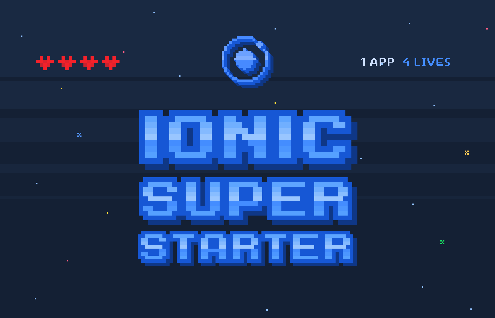

# Sans Sugar App

Sugar Tracking App for achieving a healthier eating habit.

_Note: this Ionic App requires Ionic CLI 3._

<!--  -->
<!--
The Ionic Super Starter is a batteries-included starter project for Ionic apps complete with pre-built pages, providers, and best practices for Ionic development.

The goal of the Super Starter is to get you from zero to app store faster than before, with a set of opinions from the Ionic team around page layout, data/user management, and project structure.

The way to use this starter is to pick and choose the various page types you want use, and remove the ones you don't. If you want a blank slate, this starter isn't for you (use the `blank` type instead).

One of the big advances in Ionic was moving from a rigid route-based navigation system to a flexible push/pop navigation system modeled off common native SDKs. We've embraced this pattern to provide a set of reusable pages that can be navigated to anywhere in the app. Take a look at the [Settings page](https://github.com/ionic-team/ionic-starter-super/blob/master/src/pages/settings/settings.html#L38) for a cool example of a page navigating to itself to provide a different UI without duplicating code.-->

## Table of Contents

1. [Getting Started](#getting-started)
2. [Pages](#pages)
3. [Providers](#providers)
4. [i18n](#i18n) (adding languages)

## <a name="getting-started"></a>Getting Started

To test the app:

### Develop

```bash
ionic serve
```

Run on iOS Simulator

```
ionic cordova build ios
ionic cordova emulate ios
```

Run on iOS Device

```
ionic cordova build ios
ionic cordova run ios --device
```

### Build for production

```
ionic cordova build ios --prod
```

## Pages

See pages at `pages.tx`

The app loads with the `FirstRunPage` set to `LandingPage` as the default. If the user has already gone through this page once, it will be skipped the next time they load the app.

If the tutorial is skipped but the user hasn't logged in yet, the Welcome page will be displayed which is a "splash" prompting the user to log in or create an account.

Once the user is authenticated, the app will load with the `MainPage` which is set to be the `TabsPage` as the default.

The entry and main pages can be configured easily by updating the corresponding variables in [src/pages/pages.ts](src/pages/pages.ts).

Please read the [Pages](src/pages) readme, and the readme for each page in the source for more documentation on each.

## Providers

Providers:

* items
* settings
* trackings
* user

### User

The `User` provider is used to authenticate users through its `login(accountInfo)` and `signup(accountInfo)` methods, which perform `POST` requests to an API endpoint that you will need to configure.

### Api

The `Api` provider is a simple CRUD frontend to an API. Simply put the root of your API url in the Api class and call get/post/put/patch/delete 

## i18n

Supports internationalization (i18n) out of the box with [ngx-translate](https://github.com/ngx-translate/core). This makes it easy to change the text used in the app by modifying only one file. 

### Adding Languages

To add new languages, add new files to the `src/assets/i18n` directory, following the pattern of LANGCODE.json where LANGCODE is the language/locale code (ex: en/gb/de/es/etc.).

### Changing the Language

To change the language of the app, edit `src/app/app.component.ts` and modify `translate.use('en')` to use the LANGCODE from `src/assets/i18n/`
